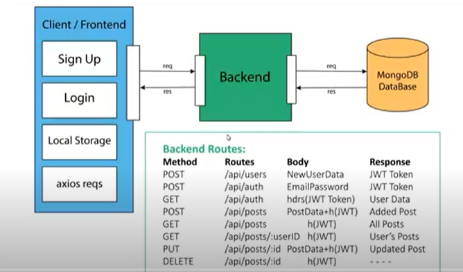

## Social Media App Backend NodeJs/Express/MongoDB

### Links:

- Heroku Deployment: https://backend-social-application.herokuapp.com/

### Backend Routes

Database is MongoDb Atlas, For API development ExpressJS is used.

### Npm Packages:

- **nodemon:**  
  nodemon is a tool that helps develop Node.js based applications by automatically restarting the node application when file changes in the directory are detected.

- **express:** 
  Express js is a framework of NodeJS used to build APIs.

- **express-validator:**  
  Validate the data which client sends to the server for any request. for example: email, password etc.

- **config:**  
  It lets you define a set of default parameters, and extend them for different deployment environments (development, qa, staging, production, etc.).
  Basically, we use this package for setting our configurations for development and productions enviornment.

- **mongoose**  
  Mongoose is a MongoDB object modeling tool designed to work in an asynchronous environment. Mongoose supports both promises and callbacks.

- **jsonwebtoken**  
  To create a specific token for a user

- **bcrypt**  
  To hash/decrypt the password

### Auth Middlewere

In auth middlewere we are getting the user id from the jwt token from the req.header.

### MongoDB

- **.save():** Save data to collection
- **.findOne({email}):** get the data from DB from one field
- **.findById(1).select({ password: 0}):** get the data by specific id and does not return
  the password by writing .select().
- **.find():** Get all the documents from collection.
- **.findByIdAndUpdate( req.params.id,{ $set: changes },{ new: true }):** First Parameter
  id by which it finds the object, $set sets the variable in which all changes are present
  and new returns the updated result.
- **.findByIdAndRemove(req.params.id):** Removes the specific object from DB with the given id.

### Herouku Deployment:

- Create App
- Settings -> Add Buildpack -> NodeJS
- Deploy -> Connect to GitHub Repo -> Enable Auto Deploy
